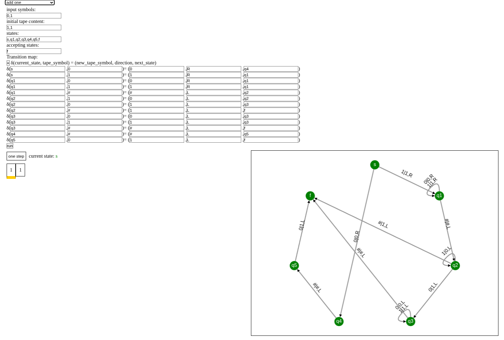

# Turing-Machine-Simulator

Browser-based, single-tape, deterministic Turing-machine simulator built with TypeScript and bundled by webpack. The UI renders the tape/head animation plus a live state‑transition graph via Cytoscape.js.

## Screenshot


## Prerequisites

```bash
npm install -g typescript webpack webpack-cli
```

## Setup

```bash
npm install
npm run build
xdg-open index.html
```

## Features

* Preset machines included for quick testing (e.g., 0ⁿ1ⁿ).
* Step/run controls with visual tape and head.
* Accept/reject detection executed in core `TuringMachine` logic.

